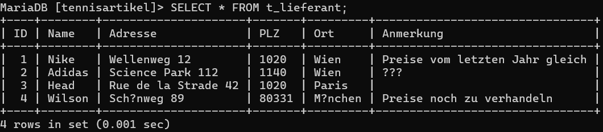
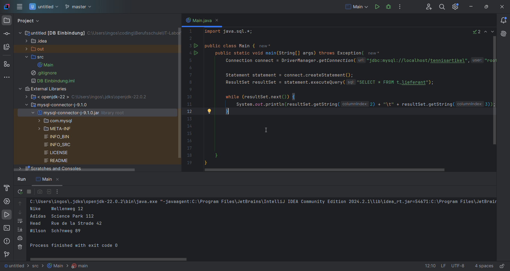

# Angabe
- [Link zur Angabe](https://www.eduvidual.at/mod/assign/view.php?id=6290148)
```
         1. Lernziele
    • Anlegen eines DB Servers (MariaDB/MySQL) am Rechner/RaspPI
    • Einbindung der DB in IntelliJ

    2. Aufgabenstellung
    • Integration einer einfachen DB Anwendung am Client
        ◦ Lokale oder Remote Datenbank
        ◦ Einbindung in IntelliJ
        ◦ https://www.jetbrains.com/help/idea/connecting-to-a-database.html#

    • Vorgang beim Einbinden von Daten aus der Datenbank dokumentieren
    • Sequenzielles Auslesen aller Datensätze aus einer Tabelle (Employee)

    • DB Struktur: (anpassen nach SQL Standard)
```
## Zusammengefasst
## Ziele
- MariaDB in IntelliJ einbinden
- Tabelle auslesen und ausgeben

# Protokoll
## Proof of Concept
- Bevor ich versuche die Angabe umzusetzen möchte ich erstmal nur
- existierende MariaDB einbinden und eine simple Query ausgeben lassen
- Dabei hatte ich lange probleme mit dem Connector
- Nach einer Stunde bin ich dann draufgekommen dass ich im Pfad einen Buchstabendreher hatte
- Ich war auch etwas verwirrt weil bei (dem gezeigten Abschnitt) der Musterlösung am Beamer
  - die variablen: `connect, statement, resultset` 
  - hatten keine Klassen dabeistehen 
  - mussten also woanders initialisiert worden sein
  - die nötigen Klassen für das Projekt waren mir also nicht klar.
- Als das einbinden der einzelnen Tabelle dann fuktionierte, ging der Rest relativ problemlos.
- 
- 
## Datenbank importieren
- Anstatt die SQL Befehle alle händisch einzugeben
- habe ich die Lösung von Christian übernommen
- Diese habe ich über PHPMyAdmin importiert
```SQL
-- Sicherstellen, dass die Tabellen existieren, bevor sie gelöscht werden
DROP TABLE IF EXISTS DEPT;
CREATE TABLE DEPT (
    DEPTNO INT(2) PRIMARY KEY,
    DNAME VARCHAR(14),
    LOC VARCHAR(13)
);

DROP TABLE IF EXISTS EMP;
CREATE TABLE EMP (
    EMPNO INT(4) PRIMARY KEY,
    ENAME VARCHAR(10),
    JOB VARCHAR(9),
    MGR INT(4),
    HIREDATE DATE,
    SAL DECIMAL(7,2),
    COMM DECIMAL(7,2),
    DEPTNO INT(2),
    CONSTRAINT FK_DEPTNO FOREIGN KEY (DEPTNO) REFERENCES DEPT(DEPTNO)
);

-- Daten einfügen in die DEPT-Tabelle
INSERT INTO DEPT (DEPTNO, DNAME, LOC) VALUES
    (10, 'ACCOUNTING', 'NEW YORK'),
    (20, 'RESEARCH', 'DALLAS'),
    (30, 'SALES', 'CHICAGO'),
    (40, 'OPERATIONS', 'BOSTON');

-- Daten einfügen in die EMP-Tabelle
INSERT INTO EMP (EMPNO, ENAME, JOB, MGR, HIREDATE, SAL, COMM, DEPTNO) VALUES
    (7369, 'SMITH', 'CLERK', 7902, '1980-12-17', 800, NULL, 20),
    (7499, 'ALLEN', 'SALESMAN', 7698, '1981-02-20', 1600, 300, 30),
    (7521, 'WARD', 'SALESMAN', 7698, '1981-02-22', 1250, 500, 30),
    (7566, 'JONES', 'MANAGER', 7839, '1981-04-02', 2975, NULL, 20),
    (7654, 'MARTIN', 'SALESMAN', 7698, '1981-09-28', 1250, 1400, 30),
    (7698, 'BLAKE', 'MANAGER', 7839, '1981-05-01', 2850, NULL, 30),
    (7782, 'CLARK', 'MANAGER', 7839, '1981-06-09', 2450, NULL, 10),
    (7788, 'SCOTT', 'ANALYST', 7566, DATE_SUB('1987-07-13', INTERVAL 85 DAY), 3000, NULL, 20),
    (7839, 'KING', 'PRESIDENT', NULL, '1981-11-17', 5000, NULL, 10),
    (7844, 'TURNER', 'SALESMAN', 7698, '1981-09-08', 1500, 0, 30),
    (7876, 'ADAMS', 'CLERK', 7788, DATE_SUB('1987-07-13', INTERVAL 51 DAY), 1100, NULL, 20),
    (7900, 'JAMES', 'CLERK', 7698, '1981-12-03', 950, NULL, 30),
    (7902, 'FORD', 'ANALYST', 7566, '1981-12-03', 3000, NULL, 20),
    (7934, 'MILLER', 'CLERK', 7782, '1982-01-23', 1300, NULL, 10);

-- BONUS Tabelle erstellen und Daten einfügen
DROP TABLE IF EXISTS BONUS;
CREATE TABLE BONUS (
    ENAME VARCHAR(10),
    JOB VARCHAR(9),
    SAL DECIMAL(7,2),
    COMM DECIMAL(7,2)
);

-- SALGRADE Tabelle erstellen und Daten einfügen
DROP TABLE IF EXISTS SALGRADE;
CREATE TABLE SALGRADE (
    GRADE INT,
    LOSAL DECIMAL(7,2),
    HISAL DECIMAL(7,2)
);

INSERT INTO SALGRADE (GRADE, LOSAL, HISAL) VALUES
    (1, 700, 1200),
    (2, 1201, 1400),
    (3, 1401, 2000),
    (4, 2001, 3000),
    (5, 3001, 9999);

-- Alle Änderungen bestätigen
COMMIT;
```

## Main
- Die SQL-Tabelle emp soll ausgelesen werden
- Für jede Zeile wird ein Employee Objekt erstellt
- Die Info dieses Employees wird ausgegeben
```java
import java.sql.*;

public class Main {
  public static void main(String[] args) throws Exception{
    Connection connect = DriverManager.getConnection("jdbc:mysql://localhost/scott","root","");

    Statement statement = connect.createStatement();
    ResultSet resultSet = statement.executeQuery("SELECT * FROM emp");

    int count = 0;
    while (resultSet.next()) {
      Employee newEmployee = new Employee(resultSet);
      newEmployee.printEmpInfo();
      count++;
    }
  }
}
```

## Employee
- Klassenvariablen für jede Zeile der Tabelle erstellen
- Konstruktor mit ResultSet als Parameter schreiben
  - `sqlRow.getInt(ColNr)`
    - Beginnt bei 1
- Methode für Ausgabe der Informationen eines Employee-Objekts

```java
import java.sql.ResultSet;
import java.util.Date;

public class Employee {
  int empNo;
  String eName;
  String job;
  int mgr;
  Date hireDate;
  double sal;
  double comm;
  int deptNo;

  public Employee (ResultSet sqlRow) throws Exception{
    empNo = sqlRow.getInt(1);
    eName = sqlRow.getString(2);
    job = sqlRow.getString(3);
    mgr = sqlRow.getInt(4);
    hireDate = sqlRow.getDate(5);
    sal = sqlRow.getDouble(6);
    comm = sqlRow.getDouble(7);
    deptNo = sqlRow.getInt(8);
  }

  public void printEmpInfo(){
    String printText = ""+empNo+"\t"+eName+"\t"+job+"\t"+mgr+"\t"+hireDate+"\t"+sal+"\t"+comm+"\t"+deptNo;
    System.out.println(printText);
  }
}

```
